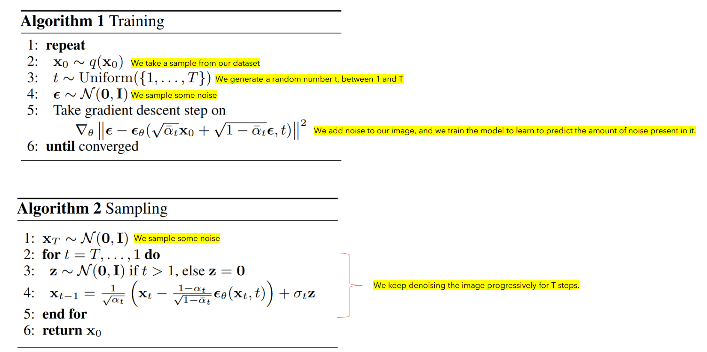
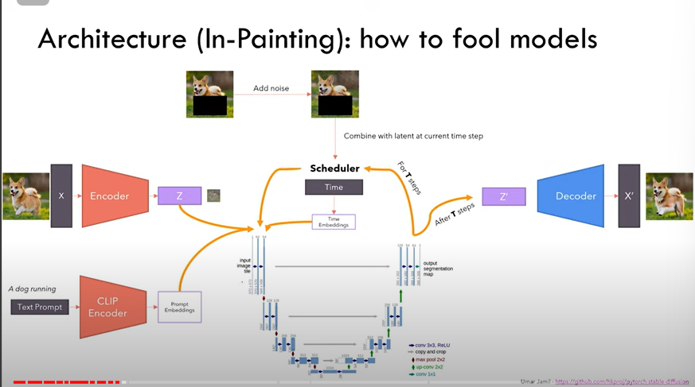
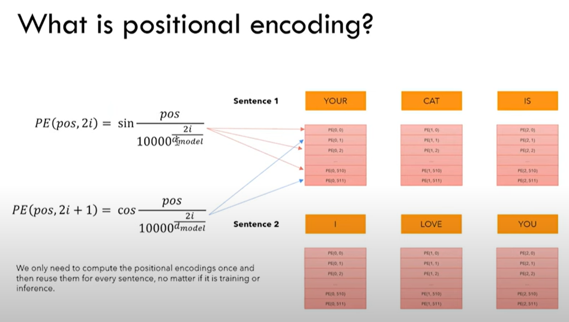

# Coding Stable Diffusion from Scratch

> Like my previous implementation, this repo is a code follow-along excercise by the [excellent tutorial](https://www.youtube.com/watch?v=ZBKpAp_6TGI) by Umar Jamil `@hkproj`. He read more than 30 papers for the 5-hour video tutorial, which is already incredible. 

The goal of this repo is to 
- Increase my and the reader's understanding Diffusion models 
- Develop a visual representation as a flowchart of the entire repository. The previous flowchart on LLaMA2 gathered a lot of encouragement, so why not!

## What is a generative model
A generative model learns a probability distribution of the data set such that we can then sample from the distribution to create new instances of data.

## Background

> See how `Equation (4)` shows how to get $x_{t}$ from the initial state $x_{0}$ directly. This only depends on the $\alpha$ parameter, which in turn depends on the $\beta$ parameter, which is just a set of numbers.

> We need to train a network called $\epsilon_{\theta}$, that, given (I.) a noisy image $\sqrt{\alpha_{t}} \cdot x_{0} + \sqrt{1 - \alpha_{t}} \cdot \epsilon $ at timestep $t$ and (II.) the timestep $t$, the model predicts the amount of noise in the (noisy) image

> Taking gradient descent will maximize the ELBO (by minimising the loss in `Step 5`) and maximize the likelihood of the data. Final goal is to model a distribution such that we maximize the likelihood of the data 

## Group Normalization
 \
Idea of using group normalization is that because the matrices are subject to pooling, items closer are more likely to be related. So we are normalizing by the groups.  
But main idea ofcourse to not let the loss function oscillate too much --> **Training faster**. 

## Need for attention 
Taken from Jay Alammar's blog. The need for attention is to ensure model understands both text and images' embeddings together and can pay *attention* to similar items in that space.

## Coding CLIP
Looks like an encoder-only model. Check the part on the left for the same. 

## Classifier Free Guidance
We inference the model **twice** - one by specifying the prompt and another by not specifying it i.e. unconditioned prompt. Then we combine the output of the model linearly - with a weight `cfg_scale` for how much weight to give to the prompt.

## Architecture
The latents (`Z`) along with the `Prompt Embeddings`, and `Time Embeddings` are run through the UNET multiple times. Objective of the UNET is to predict the amount of noise present in the latent, at a given timestamp, for many timestamps. The UNET keeps reducing the size of the input, and keeps increasing the number of features (so each pixel *captures more data*).
> Compare with Jay Alammar's image now!

Then scheduler will 'remove' noise. \ 
**We should also ensure that while denoising, the outputs remain close to the text prompt.**
In other words, UNET predicts the amount of noise to be removed to make the image a picture that follows the prompt.

Once denoising is done, we pass the output latent (`Z'`) to the decoder to construct the final output image. 

> Note: *Scheduler* in the images below corresponds to ddpm *Sampler* in the code

Here `Z` is latent representation of pure noise.

Here `Z` is latent representation of input image. But we add noise to the image because job of UNET is to predict noise from image. 

> More noise we add, more *freedom* to the UNET to alter the image i.e. pay less attention to input image. If we start from pure noise, the UNET is free to do anything it want. Adding less noise means we are restricting the UNET a bit. 

Impainting is like fooling the model. Once image-latent with noise and the Prompt Embedding is passed, UNET predicts the noise for the entire image. Now, for all regions except the required black rectangle, we replace the model's outputs with the original image's corresponding regions. 

This fools the model to think that the model itself came up with the noise value for 'only the rectangle region' and it kept the remaining regions constant. 

## Time Embeddings
Similar to how earlier we converted positions to vectors (embeddings), now we will convert timestamps to vectors

## Beta parameter in Scheduler
Beta is a series of numbers (hence, schedule) that indicate the **variance** of noise added to the data

## Adding noise to image
Note the mean and variance of noise. This formula is especially helpful because we can get noisy version at any timestep t from  given image at timestep 0

## Removing noise from image
Use formula as given in paper. 
Latents is $x_{t}$, Noise predicted by unet is $\epsilon_{\theta}$

**More info**: We need some more formulae from the paper to compute the steps in the ddpm scheduler. 

